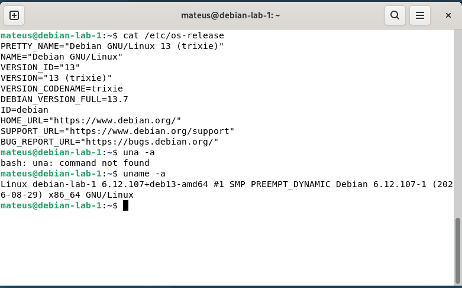

# Diagnostico inicial do Servidor Techlab

## Distribuição GNU/Linux

**Sistema operacional:** Debian GNU/Linux 13 (trixie)
**Versão completa:** 13.7\n
**Explicação:** Essas informações nos permitem identificar o Nome da distribuição
bem como a sua versão, 
