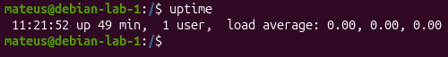
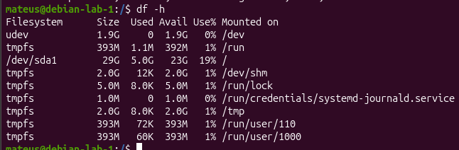
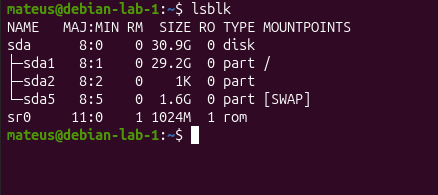
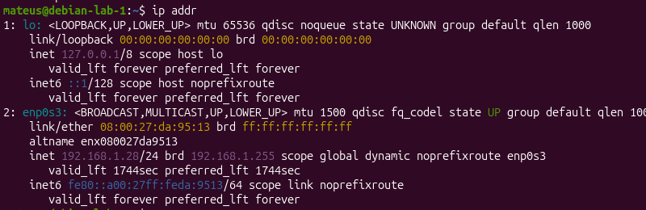
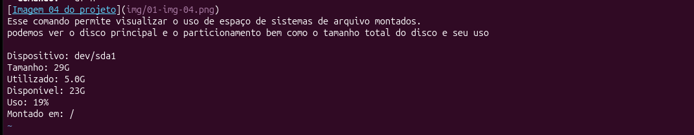
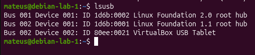
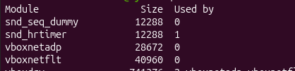

# Diagnostico inicial do Servidor Techlab

## Distribuição GNU/Linux

**Sistema operacional:** Debian GNU/Linux 13 (trixie)
**Versão completa:** 13.7 
**Explicação:** Essas informações nos permitem identificar o nome da distribuição
bem como a sua versão completa instalada.

## Kernel 
**Hostname:** debian-lab-1
**Release do Kernel:** 6.12.10+deb13-amd64
**Arquitetura:** x86_64

Na imagem tbm podemos ver informações sobre o kernel dos sistema, o kernel é o responsavel por gerenciar alguns recursos do sistema, é importante não confundir A distribuição com o kernel apesar de trabalharem juntas não são a mesma coisa, o kernel possui sua propria versão, na imagem também podemos ver sua arquitetura e o hostname da VM em questão.

## Tempo de atividade
**Comando Uptime** 

Ao executar o comando uptime podemos acessar informações como há quanto tempo a maquina está ligada, o número de usuários e o load average que mostra a carga média de uso do sistema

**Tempo de atividade:** 6 horas e 30 minutos
**Usuários/sessões:** 2
**Load average:8** 0.00, 0.00, 0.00

## Memória RAM e Swap
**Comando:** free -h

Esse comando permitiu visualizar informações sobre a memória RAM e swap, na imagem podemos ver  a  memória total disponível e a swap
que é um local onde é armazenada uma parte da memória RAM que é usada para  acelerar o sistema essa memória pode ser recuperada caso necessário

**RAM total:** 3.8GiB
**RAM utilizada:** 1.1 GiB
**RAM livre:** 2.1 GiB
**RAm disponivel:** 2.7 GiB
**Swap total:** 1.6 GiB
**Swap utilizada:** 0B

## Sistemas de arquivos
**Comando:** df-h

Esse comando permite visualizar o uso de espaço de sistemas de arquivo montados.
podemos ver o disco principal e o particionamento bem como o tamanho total do disco e seu uso

Dispositivo: /dev/sda1
Tamanho: 29G
Utilizado: 5.0G
Disponível: 23G
Uso: 19%
Montado em: /

## Dispositivos de armazenamento
**Comando** lsblk

Nesse comando podemos visualizar os dispositivos de armazenamento do sistema
o sda sifnifica o disco inteiro enquanto o sda1 é a partição e sda5 é a primeira partição lógica criada dentro de uma partição estendida

**Sda:** disco de 30.9G
**Sda1:** partição de 29.2G montada em /
**Sda5:** Partição de 1.6G utilizada como SWAP
**Sr0:**  dispositivo do tipo ROM

## Rede
**Comando:** ip addr

Nesse comando podemos visualizar informações de rede do sistema como o localhost que é refere-se a própria maquina e a enp0s3 que é a interface de rede.

**lo:** Interface de loopback
**127.0.0.1/8:** Endereço Ipv4 de loopback
**enp0s3:** interface de rede da vm
**UP:** interface está ativa habilitada
**192.168.1.28** Endereço IPv4 da vm
**/24:** Prefixo da rede 

## Dispositivos PCI relevantes 
**Comando** lspci

Nesse comando podemos visualizar os dispositivos conectados ao barramento PCI como rede, video, áudio e SATA

**Rede:** Intel 82540em Ggabit Ethernet controler
**Vídeo:**VMware SVGA II asapter 
**Àudio:**Intel AC'97 audio controller
**SATA:** Intel ich8m SATA controller

## Dispositivos USB 
**Comando** lsusb

Nesse comando podemos visualizar dispositivos USB reconhecidos pelo sistema 

## Módulos do Kernel
**Comando** lsmod

Nesse comando podemos visualizar os módulos do Kernel que são componentes que podem ser carregados no sistema
para acrescentar uma funcionalidade

**Module:** Nome do módulo carregado
**Size:** Tamanho do módulo em bytes 
**Used by:** Quantidade de referências/dependências em uso

