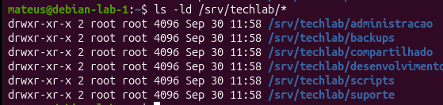

# Parte-2 Estrutura de diretórios da Techlab

## Diretório Principal

O diretório `/srv/techlab`foi criado para armazenar os dados no ambiente da Techlab.

**Comando:** `ls -ld /srv/techlab/*`

lista de diretórios que foram criados

1. Desenvolvimento
2. Suporte
3. Administração
4. Compartilhado
5. Backups
6. Scripts

O diretório /srv foi utilizado para criar a estrutura da techlab porque um diretório destinado a serviços fronecidos pelo sistema não seria prudente cria-lo em uma home de usuário.
