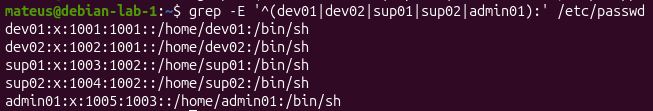
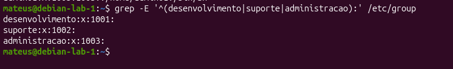

# Parte 3 -  Usuários e grupos da TechLab

## Grupos

Foram criados três grupos para representar as equipes:

- desenvolvimento
- suporte
- administracao

**Comando de validação:** `grep -E '^(desenvolvimento|suporte|administracao):' /etc/group`

## Usuários

Os usuários foram associados aos seus respectivos grupos principais:

| Usuário | Grupo principal |
|---------|-----------------|
| dev01 | desenvolvimento |
| dev02 | desenvolvimento |
| sup01 | suporte |
| sup02 | suporte |
| admin01 | administracao |

**Validação:** comando `id`

O comando `id` permite verificar o UID, o GID e os grupos associados
a cada usuário.

## Arquivos de contas

O `/etc/passwd` contém informações gerais das contas, como UID, GID,
diretório home e shell configurado.

O `/etc/group` contém informações sobre os grupos do sistema.

O `/etc/shadow` armazena informações protegidas relacionadas à
autenticação e às senhas. Seu conteúdo não foi incluído na documentação
para não expor informações sensíveis.

