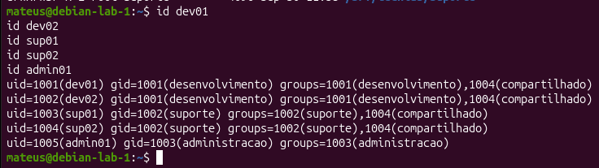
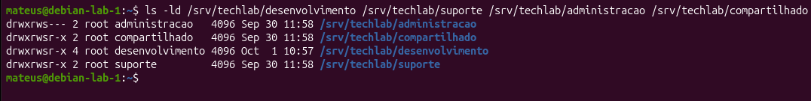
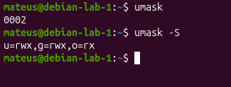

# Parte 4 - Permissões e controles de acesso

## Objetivo

Configurar as permissões dos diretórios da TechLab para que cada equipe tenha acesso adequado aos seus arquivos, impedindo alterações por usuários não autorizados.

Também foram utilizados grupos, permissões numéricas e simbólicas, umask e setgid para controlar a criação e o compartilhamento de arquivos.

## 1. Diretório desenvolvimento

**Grupo proprietário:** `desenvolvimento`

**Permissão:** `775`

**Comandos utilizados:**

`sudo chgrp desenvolvimento /srv/techlab/desenvolvimento`

`sudo chmod 775 /srv/techlab/desenvolvimento`

`sudo chmod g+s /srv/techlab/desenvolvimento`

O comando `chgrp` altera o grupo proprietário do diretório. Nesse caso, o grupo do diretório foi alterado para `desenvolvimento`.

A permissão `775` permite que o proprietário e o grupo tenham leitura, escrita e execução, enquanto outros possuem apenas leitura e execução.

O comando `chmod g+s` adiciona o bit setgid ao diretório. Dessa forma, novos arquivos e subdiretórios criados dentro dele herdam o grupo proprietário do diretório pai.

## 2. Diretório suporte

**Grupo proprietário:** `suporte`

**Permissão:** `775`

**Comandos utilizados:**

`sudo chgrp suporte /srv/techlab/suporte`

`sudo chmod 775 /srv/techlab/suporte`

`sudo chmod g+s /srv/techlab/suporte`

Assim como no diretório de desenvolvimento, os comandos definem o grupo proprietário, configuram as permissões e ativam o setgid.

Os membros do grupo `suporte` possuem leitura, escrita e execução no diretório.

## 3. Diretório administração

**Grupo proprietário:** `administracao`

**Permissão:** `770`

**Comandos utilizados:**

`sudo chgrp administracao /srv/techlab/administracao`

`sudo chmod 770 /srv/techlab/administracao`

`sudo chmod g+s /srv/techlab/administracao`

Nesse diretório também foram configurados o grupo proprietário e o setgid.

A principal diferença está nas permissões. Com `770`, o proprietário e o grupo possuem leitura, escrita e execução, enquanto outros usuários não possuem nenhuma permissão.

Dessa forma, o diretório de administração fica restrito aos usuários autorizados.

## 4. Diretório compartilhado

**Grupo proprietário:** `compartilhado`

**Permissão:** `775`

**Usuários do grupo compartilhado:**

- `dev01`
- `dev02`
- `sup01`
- `sup02`

**Comandos utilizados:**

`sudo groupadd compartilhado`

`sudo usermod -aG compartilhado dev01`

`sudo usermod -aG compartilhado dev02`

`sudo usermod -aG compartilhado sup01`

`sudo usermod -aG compartilhado sup02`

`sudo chgrp compartilhado /srv/techlab/compartilhado`

`sudo chmod 775 /srv/techlab/compartilhado`

`sudo chmod g+s /srv/techlab/compartilhado`

O grupo `compartilhado` foi criado para permitir que as equipes de desenvolvimento e suporte trabalhem em um diretório comum.

A opção `-aG` do comando `usermod` adiciona o usuário a um grupo suplementar sem substituir seu grupo principal.

A permissão `775` não permite escrita para outros usuários, evitando o uso inseguro da permissão `777`.

### Evidência dos grupos dos usuários

A saída do comando `id` confirma que `dev01` e `dev02` possuem `desenvolvimento` como grupo principal e também pertencem ao grupo `compartilhado`.

Os usuários `sup01` e `sup02` possuem `suporte` como grupo principal e também pertencem ao grupo `compartilhado`. O usuário `admin01` pertence ao grupo `administracao`.

## Evidência das permissões dos diretórios

A saída do comando `ls -ld` confirma os grupos proprietários e as permissões configuradas nos diretórios `desenvolvimento`, `suporte`, `administracao` e `compartilhado`.

Os diretórios `desenvolvimento`, `suporte` e `compartilhado` possuem permissões equivalentes a `775`, enquanto o diretório `administracao` possui permissões equivalentes a `770`.

O `s` presente nas permissões do grupo, como em `drwxrwsr-x`, indica que o bit setgid está ativo.

## 5. umask

A umask define quais permissões serão retiradas das permissões base quando novos arquivos e diretórios são criados.

Neste ambiente, a umask configurada é `0002`.

Arquivos utilizam normalmente a base `666`. Com a umask `0002`, as permissões resultantes normalmente são `664`.

Diretórios utilizam normalmente a base `777`. Com a mesma umask, as permissões resultantes normalmente são `775`.

Isso permite que proprietário e grupo tenham permissão de escrita, enquanto outros usuários não possuem permissão de escrita.

### Evidência da umask

Os comandos `umask` e `umask -S` mostram que a máscara configurada no ambiente é `0002`, representada simbolicamente como:

`u=rwx,g=rwx,o=rx`

A configuração é adequada para o ambiente colaborativo do laboratório, pois mantém a permissão de escrita para o grupo.

## Resultado

Os diretórios da TechLab foram configurados com grupos e permissões adequados para cada equipe.

Os diretórios de desenvolvimento e suporte permitem o trabalho dos membros de suas respectivas equipes, enquanto o diretório de administração possui acesso mais restrito.

O grupo `compartilhado` permite a colaboração entre usuários de desenvolvimento e suporte.

O uso de setgid e umask auxilia na manutenção das permissões e dos grupos durante a criação de novos arquivos e diretórios, evitando a utilização de permissões excessivas como `777`.
