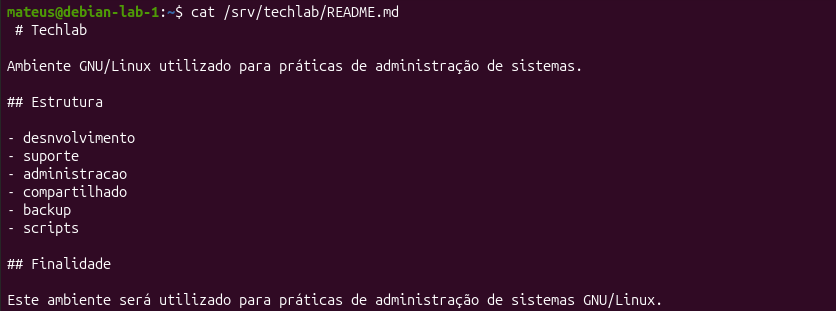

# Parte 5 — Edição de arquivo com VI

## Objetivo

Criar e editar o arquivo `/srv/techlab/README.md` utilizando o editor VI/Vim.

## Arquivo criado

O arquivo utilizado nesta etapa foi:

`/srv/techlab/README.md`

## Conteúdo do README

O arquivo contém informações sobre:

- finalidade do servidor;
- estrutura de diretórios;
- grupos existentes;
- regras básicas de acesso;
- localização dos scripts;
- localização dos backups.

## Comando utilizado

```bash
sudo vi /srv/techlab/README.md
```

## Operações realizadas no VI

Foram praticadas operações de inserção, salvamento, fechamento, reabertura e modificação do arquivo.

Alguns comandos utilizados:

```text
i    → entrar no modo de inserção
Esc  → voltar ao modo normal
:w   → salvar
:q   → sair
:wq  → salvar e sair
G    → ir para o final do arquivo
o    → criar uma nova linha abaixo
```

## Validação

Após salvar o arquivo, seu conteúdo foi verificado com:

```bash
cat /srv/techlab/README.md
```

## Resultado

O arquivo `/srv/techlab/README.md` foi criado e editado com sucesso utilizando o VI/Vim.

**Evidência**



