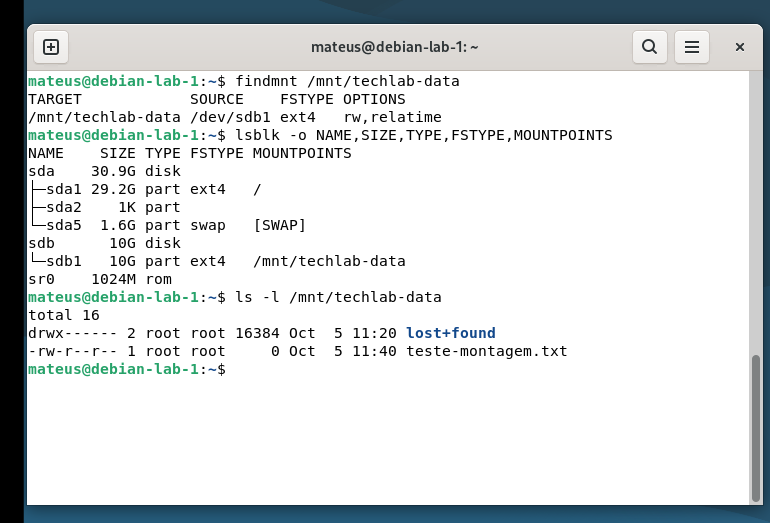

# Parte 6 - Armazenamento

## Objetivo

Adicionar um segundo disco virtual ao servidor, particioná-lo, criar um sistema de arquivos e configurar sua montagem automática.

## Disco e particionamento

Foi adicionado um disco de 10 GiB identificado como `/dev/sdb`.

O disco foi particionado utilizando:

`sudo fdisk /dev/sdb`

Foi criada uma tabela GPT e a partição `/dev/sdb1`.

## Sistema de arquivos e montagem

A partição foi formatada como ext4:

`sudo mkfs.ext4 /dev/sdb1`

Foi criado o ponto de montagem:

`sudo mkdir -p /mnt/techlab-data`

E realizada a montagem:

`sudo mount /dev/sdb1 /mnt/techlab-data`

## Montagem automática

O UUID foi identificado com:

`sudo blkid /dev/sdb1`

A partição foi adicionada ao `/etc/fstab` para ser montada automaticamente em `/mnt/techlab-data`.

A configuração foi testada com:

`sudo mount -a`

## Validação

Após reiniciar o servidor, a montagem foi validada com:

`findmnt /mnt/techlab-data`

`lsblk -o NAME,SIZE,TYPE,FSTYPE,MOUNTPOINTS`

O resultado confirmou que `/dev/sdb1`, utilizando ext4, foi montada automaticamente em `/mnt/techlab-data`.

