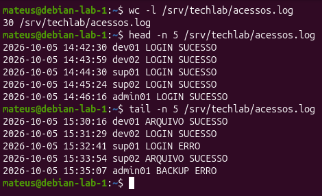
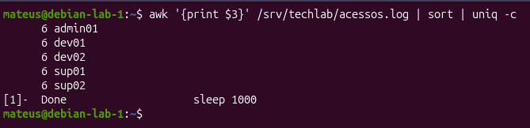
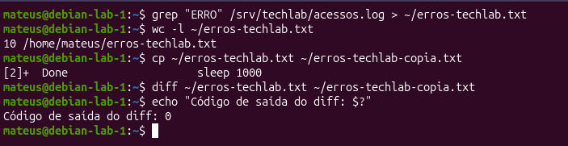

# Parte 7 — Logs e processamento de texto

## Objetivo

Criar e analisar um arquivo de log fictício utilizando comandos de processamento de texto do GNU/Linux.

## Arquivo utilizado

`/srv/techlab/acessos.log`

O arquivo possui 30 registros no formato:

`DATA HORA USUÁRIO AÇÃO RESULTADO`

Exemplo:

`2026-10-05 15:05:27 admin01 BACKUP ERRO`

### Evidência

A imagem demonstra que o arquivo possui 30 registros e apresenta as cinco primeiras e as cinco últimas linhas.

## Principais comandos

Visualização:

`cat`, `less`, `head` e `tail`

Pesquisa:

`grep`, `grep -E` e `egrep`

Processamento:

`cut`, `awk`, `wc`, `sort` e `uniq`

Comparação:

`diff`

Também foram utilizados pipes (`|`) e redirecionamentos (`>` e `>>`) para combinar comandos e salvar resultados.

## Exemplo de análise

Contagem de registros por usuário:

`awk '{print $3}' /srv/techlab/acessos.log | sort | uniq -c`

### Evidência

A combinação de `awk`, `sort` e `uniq` extrai os usuários, ordena os dados e contabiliza os registros de cada usuário.

## Redirecionamento e comparação

Os registros contendo `ERRO` foram filtrados e redirecionados para um arquivo:

`grep "ERRO" /srv/techlab/acessos.log > ~/erros-techlab.txt`

A quantidade de registros foi verificada com:

`wc -l ~/erros-techlab.txt`

Uma cópia foi criada e comparada utilizando `diff`.

### Evidência

Foram encontrados 10 registros contendo `ERRO`. O `diff` não apresentou diferenças entre os arquivos e retornou código de saída `0`.

## Resultado

Foi possível pesquisar, filtrar, ordenar, contar e comparar informações presentes no arquivo de log utilizando ferramentas nativas do GNU/Linux.
