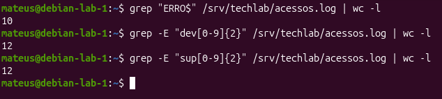
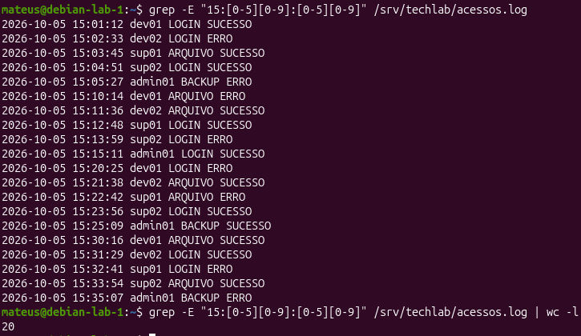
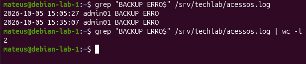

# Parte 8 — Expressões Regulares

## Objetivo

Utilizar expressões regulares para localizar informações específicas no arquivo de log `/srv/techlab/acessos.log`.

## Expressões utilizadas

### 1. Registros com erro

Regex:

`ERRO$`

Comando:

`grep "ERRO$" /srv/techlab/acessos.log`

Objetivo: localizar registros cujo resultado seja ERRO.

Resultado obtido: 10 registros.

Metacaractere utilizado: `$`, que representa o final da linha.

### 2. Usuários de desenvolvimento

Regex:

`dev[0-9]{2}`

Comando:

`grep -E "dev[0-9]{2}" /srv/techlab/acessos.log`

Objetivo: localizar usuários com prefixo `dev` seguido de dois dígitos.

Metacaracteres utilizados: `[0-9]` representa um dígito e `{2}` exige duas ocorrências.

### 3. Usuários de suporte

Regex:

`sup[0-9]{2}`

Comando:

`grep -E "sup[0-9]{2}" /srv/techlab/acessos.log`

Objetivo: localizar usuários com prefixo `sup` seguido de dois dígitos.

### 4. Faixa de horário

Regex:

`15:[0-5][0-9]:[0-5][0-9]`

Comando:

`grep -E "15:[0-5][0-9]:[0-5][0-9]" /srv/techlab/acessos.log`

Objetivo: localizar registros entre 15:00:00 e 15:59:59.

Resultado esperado: 20 registros.

`[0-5]` limita o primeiro dígito dos minutos e segundos e `[0-9]` permite o segundo dígito entre 0 e 9.

### 5. Expressão própria

Regex:

`BACKUP ERRO$`

Comando:

`grep "BACKUP ERRO$" /srv/techlab/acessos.log`

Objetivo: localizar operações de backup que terminaram com erro.

Resultado esperado: 2 registros.

## Conclusão

As expressões regulares permitiram filtrar o log por resultado, usuário, horário e tipo de operação sem alterar o arquivo original.

## Evidências

### Filtros por resultado e usuário

### Filtro por faixa de horário

### Expressão regular própria

