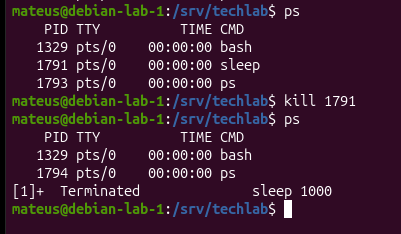
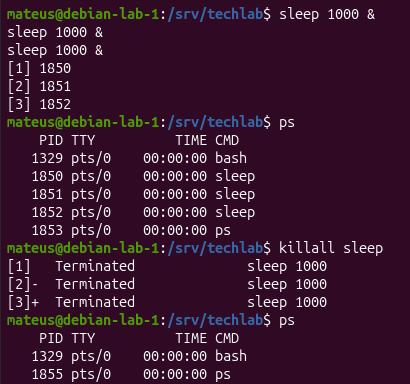
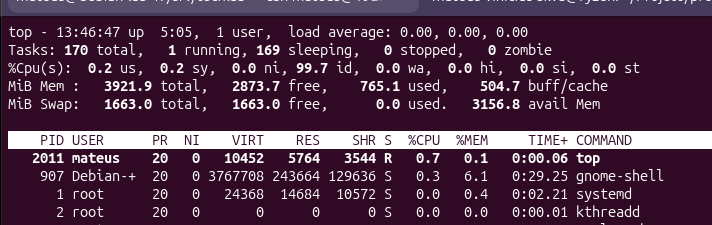
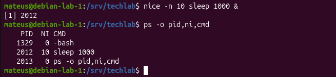
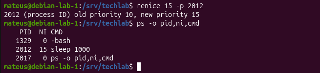
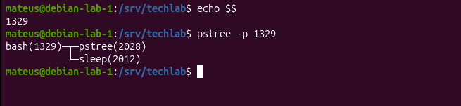
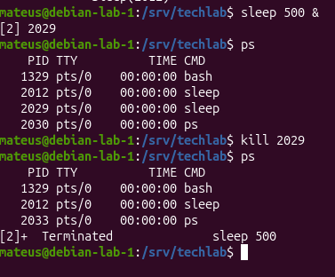

# Parte 9 - Gerenciamento de processos

## Objetivo

Praticar o monitoramento e gerenciamento de processos no GNU/linux, identificando PIDs, analisando processos em execução, enviando sinais e ajustando prioridades.

## 1. Identificação de processos 

O comando `ps` foi utilizado para visualizar os processos associados ao terminal.

Para criar um processo de teste em segundo plano foi utilizado: `sleep 1000 &` 

Com o comando: 

`ps`

Foi possivel identificar o PID do processo `sleep`.

O PID (Process ID) é um número utilizado pelo sistema operacional para identificar individualmente cada processo em execução 

### Evidência 

## 2. Encerramento de processos 

Para encerrar um processo de maneira controlada foi utilizado: 

`kill PID`

Por padrão, o comando `kill` envia o sinal SIGTERM (15), solicitando que o processo seja encerraado. No teste realizado, o processo `sleep` possuia o PID `1791`. Foi executado:

`kill 1791` 

Após o envio do sinal, o comando `ps` foi utilizado novamente para confirmar que o processo havia sido encerrado.

### SIGTERM e SIGKILL

O SIGTERM (15) solicita o encerramento controlado do processo e deve ser a primeira opção utilizada 

O SIGKILL (9) força o encerramento do processo e pode ser utilizado quando um processo não responde ao encerramento normal.

Exemplo: 

`kill -9 PID` 

A estratégia utilizada foi: 

`SIGTERM > verificar > SIGKILL, se necessário` 

## Evidência 

A evidência mostra o processo `sleep` com PID `1791`, seu encerramento utilizando `kill` e a validação posterior com `ps` 

## 3. Kill e killall

O comando `kill`permite enviar um sinal para um processo especifico utilizando seu PID.

Exemplo: 

`kill PID` 

já o comando `killall`permite selecionar processos pelo nome.

Durante o teste foram criados três processos `sleep`em background. Em seguida foi utilizado:

`killall sleep` 

Após o comando, `ps` foi executado novamente para verificar o resultado. 

### Evidência 

A evidência mostra vários processos `sleep` em execução e o encerramento desses processos utilizando `killall sleep`.

Dessa forma, foi possível observar que `kill` pode atuar sobre um processo específico pelo PID, enquanto `killall` seleciona processos pelo nome.

## 4. Monitoramento com top

O comando `top` foi utilizado para monitorar os processos e o consumo de recursos do sistema em tempo real.

Entre as informações observadas estão:

- `PID`: identificação do processo;
- `USER`: usuário responsável pelo processo;
- `%CPU`: percentual de utilização da CPU;
- `%MEM`: percentual de utilização da memória;
- `COMMAND`: comando associado ao processo.

O `top` atualiza essas informações continuamente e pode ser encerrado pressionando a tecla `q`.

### Evidência

A evidência mostra o monitoramento dos processos em tempo real, incluindo PID, usuário, utilização de CPU, utilização de memória e comando associado.

## 5. Prioridade de processos com nice

O comando `nice` foi utilizado para iniciar um processo com um valor específico de niceness.

Foi executado:

`nice -n 10 sleep 1000 &`

Para verificar a prioridade do processo foi utilizado:

`ps -o pid,ni,cmd`

O processo `sleep`, com PID `2012`, apresentou o valor `NI = 10`.

Quanto maior o valor de niceness, menor é a prioridade relativa de CPU do processo.

De forma simplificada:

`nice menor → maior prioridade`

`nice maior → menor prioridade`

### Evidência

A evidência mostra o processo `sleep 1000` iniciado com niceness `10` e a confirmação do valor na coluna `NI` utilizando o comando `ps`.

## 6. Alteração de prioridade com renice

O comando `renice` foi utilizado para alterar a niceness de um processo que já estava em execução.

O processo `sleep`, com PID `2012`, possuía inicialmente `NI = 10`.

Foi executado:

`renice 15 -p 2012`

O sistema informou que a prioridade anterior era `10` e que o novo valor passou a ser `15`.

Para validar a alteração foi utilizado:

`ps -o pid,ni,cmd`

A coluna `NI` confirmou que o processo passou a possuir niceness `15`.

### Evidência

A evidência mostra a alteração da niceness do processo de `10` para `15` utilizando `renice` e sua posterior validação com o comando `ps`.

## 7. Árvore de processos

O PID do shell atual foi identificado utilizando:

`echo $$`

O comando retornou o PID `1329`.

Em seguida foi executado:

`pstree -p 1329`

O comando `pstree` permite visualizar os processos de forma hierárquica, facilitando a identificação das relações entre processos pais e filhos.

No teste realizado, o `bash` com PID `1329` aparece como processo pai, enquanto os processos `pstree` e `sleep` aparecem abaixo dele.

### Evidência

A evidência mostra o PID do shell atual e a árvore de processos, demonstrando a relação entre o processo `bash` e os processos iniciados a partir dele.

## 8. Teste final e validação

Como teste final, foi criado um processo em background utilizando:

`sleep 500 &`

O processo recebeu o PID `2029`.

O comando `ps` foi utilizado para confirmar que o processo estava em execução.

Em seguida foi executado:

`kill 2029`

Como o sinal não foi especificado, o comando `kill` enviou SIGTERM por padrão.

Após o encerramento, o comando `ps` foi executado novamente. O PID `2029` não apareceu mais na lista, confirmando que o processo havia sido encerrado.

### Evidência

A evidência demonstra a criação do processo `sleep 500` em background, sua identificação pelo PID `2029`, o envio de SIGTERM e a validação posterior do encerramento.

## Resultado

Foram praticados os principais conceitos de gerenciamento de processos no GNU/Linux, incluindo identificação por PID, execução em background, monitoramento, sinais, encerramento de processos, árvore de processos e controle de prioridade.

Os testes também demonstraram a importância de verificar o estado do sistema após uma ação administrativa, seguindo o fluxo:

`identificar → executar → validar` 
